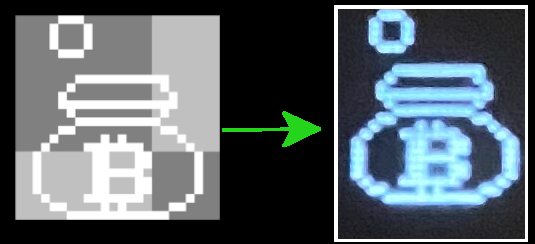

# Aseprite-SSD1306 Utility

## Overview
Ever want to draw an image or animation on Aseprite and have it show up on your SSD1306 screen? Look no further than the creatively-named **Aseprite-SSD1306 Utility**! This command-line program takes an Aseprite file and generates a C or Python array literal of all your Aseprite frames that you can copy into your C/C++ or Python codebase.  Alternatively, this utility show a preview of what the frames will look like on your SSD1306. 


## Compiling
### Linux and macOS
- Requires either clang or gcc to be in $PATH.
- No external library dependencies!
- For release mode executable run `./build.sh`
- For debug build run `./build.sh debug`

### Windows
- Requires a clang installation and `clang-cl` in `%PATH%`.
- For release mode executable run `build.bat`.
- For debug build run `build.bat debug`.

## Systems Tested On
- macOS Big Sur.
- Manjaro Linux and Ubuntu on WSL2. Binary available for download.
- Windows 10. Binary available for download.

## Usage
- `./aseprite_ssd1306 [-pv] aseprite_file`
 	- `-v` -- Preview each frame in the Aseprite file.
 	- `-p` -- Output the array as python.
    - Without any flag specified this program outputs a C array SSD1306-friendly bytes of each frame.

### Input Aseprite File

There are a few constraints that the Aseprite file needs to conform to:
- Any non-transparent pixel will be rendered as a white pixel on the SSD1306.  Transparent pixels will be black.
- This program does not currently support indexed colors.


### Output C Array

By default, this program outputs a 3-dimensional C array where each dimension are the frames, height, and width respectively. Each byte in the array represents a 1x8 pixel-wide vertical line, which is the native byte representation that the SSD1306 uses. In a given byte, the least-significant bit is the top-most pixel whereas the most significant bit is the bottom most pixel. If it a bit is 1, the pixel is white, else it is black. **NOTE:** If the image is less than 8 pixels tall, it will set 0s in the most signifcant bits.

#### Example:
When running the following command:
```
./aseprite_ssd1306 examples/bitcoinart.aseprite
```
Where `examples/bitcoinart.aseprite` contains the following 3 frames:


We get the following output:

```c
//Image width: 24 pixels, or 24 bytes, height: 24 pixels, or 3 bytes
const unsigned char animation[3][3][24] = {
    {
        {0x0,0x0,0x0,0x0,0x0,0x0,0x0,0x80,0x80,0x80,0x80,0x80,0x80,0x80,0x80,0x80,0x80,0x80,0x0,0x0,0x0,0x0,0x0,0x0,},
        {0x0,0x0,0x0,0x80,0x40,0x26,0x2D,0x14,0x94,0x94,0xD4,0x94,0xD4,0x94,0x94,0x14,0x14,0x2D,0x26,0x40,0x80,0x0,0x0,0x0,},
        {0x0,0x0,0x1F,0x20,0x40,0x40,0x80,0x80,0xA0,0xBF,0xFF,0xA4,0xE4,0xA4,0xBF,0x9B,0x80,0x80,0x40,0x40,0x20,0x1F,0x0,0x0,},
    },

    {
        {0x0,0x0,0x0,0x0,0xE,0x11,0x11,0x91,0x8E,0x80,0x80,0x80,0x80,0x80,0x80,0x80,0x80,0x80,0x0,0x0,0x0,0x0,0x0,0x0,},
        {0x0,0x0,0x0,0x80,0x40,0x26,0x2D,0x14,0x94,0x94,0xD4,0x94,0xD4,0x94,0x94,0x14,0x14,0x2D,0x26,0x40,0x80,0x0,0x0,0x0,},
        {0x0,0x0,0x1F,0x20,0x40,0x40,0x80,0x80,0xA0,0xBF,0xFF,0xA4,0xE4,0xA4,0xBF,0x9B,0x80,0x80,0x40,0x40,0x20,0x1F,0x0,0x0,},
    },

    {
        {0x0,0x0,0x0,0x0,0x0,0x0,0x0,0xC0,0x20,0x20,0x20,0xC0,0x80,0x80,0x80,0x80,0x80,0x80,0x0,0x0,0x0,0x0,0x0,0x0,},
        {0x0,0x0,0x0,0x80,0x40,0x26,0x2D,0x15,0x96,0x96,0xD6,0x95,0xD4,0x94,0x94,0x14,0x14,0x2D,0x26,0x40,0x80,0x0,0x0,0x0,},
        {0x0,0x0,0x1F,0x20,0x40,0x40,0x80,0x80,0xA0,0xBF,0xFF,0xA4,0xE4,0xA4,0xBF,0x9B,0x80,0x80,0x40,0x40,0x20,0x1F,0x0,0x0,},
    },

};
```

We have 3 nested arrays -- The outmost array has 3 elements since we have 3 frames in this animation.  The middle nested array has 3 elements since each byte represents 8 pixels vertically. 3 * 8 = 24 and 24 is our image height. The inner most array has 24 elements (bytes) since each byte represents 1 pixel horizontally.  1 * 24 = 24 and 24 is our image width. 

### Preview
When the `-v`flag is specified, an preview of each frame in printed in the terminal, where each black pixel is a `0` and each white pixel is a `1`.

#### Example
For an Aseprite file that contains the following 3 frames:


We get the following output:
```
000000000000000000000000
000000000000000000000000
000000000000000000000000
000000000000000000000000
000000000000000000000000
000000000000000000000000
000000000000000000000000
000000011111111111000000
000000100000000001000000
000001000000000000100000
000001111111111111100000
000000100000000001000000
000000011111111110000000
000001100000000001100000
000010000010100000010000
000100001111111000001000
001000000110001100000100
001000000110001100000100
001000000111111000000100
001000000110001100000100
001000000110001100000100
000100001111111000001000
000011000010100000110000
000000111111111111000000


000001110000000000000000
000010001000000000000000
000010001000000000000000
000010001000000000000000
000001110000000000000000
000000000000000000000000
000000000000000000000000
000000011111111111000000
000000100000000001000000
000001000000000000100000
000001111111111111100000
000000100000000001000000
000000011111111110000000
000001100000000001100000
000010000010100000010000
000100001111111000001000
001000000110001100000100
001000000110001100000100
001000000111111000000100
001000000110001100000100
001000000110001100000100
000100001111111000001000
000011000010100000110000
000000111111111111000000


000000000000000000000000
000000000000000000000000
000000000000000000000000
000000000000000000000000
000000000000000000000000
000000001110000000000000
000000010001000000000000
000000010001111111000000
000000110001000001000000
000001001110000000100000
000001111111111111100000
000000100000000001000000
000000011111111110000000
000001100000000001100000
000010000010100000010000
000100001111111000001000
001000000110001100000100
001000000110001100000100
001000000111111000000100
001000000110001100000100
001000000110001100000100
000100001111111000001000
000011000010100000110000
000000111111111111000000
```
